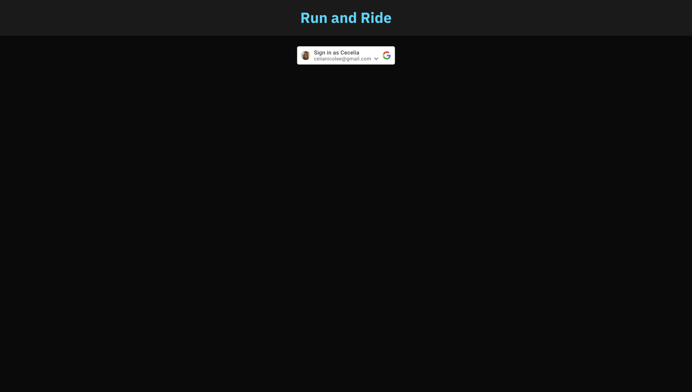
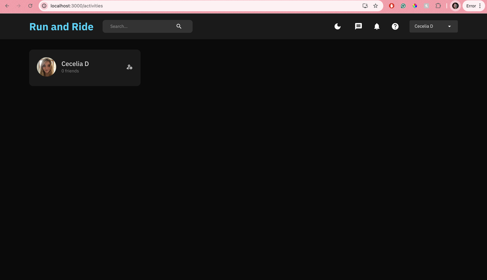
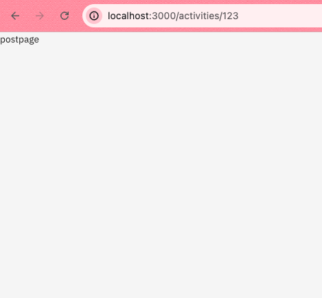

# Run and Ride Web App
The purpose of Run and Ride is to give users the opportunity to make friends and organize sports outings with those around them. When completed a user will have a newsfeed of friend activities and will be able to make posts encouraging other users to RSVP to their runs/rides. Users will also have the capability to like, comment, make groups, and post their own solo/group rides.

## Iteration 2 - Frontend
For iteration two I worked a lot on getting Google Authentication to work. The user is now able to login through Google and is met with a personalized home page. There is a button for Dark and Light mode to toggle between looks that is functional. If a user logs in through google for the first time their Google Id and corresponding info is added to the users table of the backend. I added a users widget which uses Redux to determine the current user and then uses the current user to request that user object from the backend and populate the widget. I plan to add more functionality to this such as location, post count, interests and more.

I feel good about the progress that I made and what is left to do on this app. In my final week I am adding a functionality to add friends and a news feed that consists of the posts of friends. This week I had a bit of an issue with Google Authentication, but was able to eventually solve it.

### Screenshots

## Iteration 1 - Frontend
I am working alone on the final project so all progress has been completed by Cecelia Dixon. For iteration 1 of the final project frontend I began with making a React app. I started to configure app/indexes and began styling. For this project I intend to use MUI the React component library and Redux to manage state for this project.

While there is not much to be seen on the frontend as of now I started with my redux state file to handle a dark and light mode, loading posts, friends, and login capabilities. I made routes for each page and this works locally, I tested loading in data, in my most recent push it is rather bare bones. I also made and styled a navbar component to be used.

I still have to implement a profile page, a home page, and a posts page. I need to update services more to load in the data needed from the back end. I also need to learn how to implement making a profile through the google authentication.

### Screenshots

