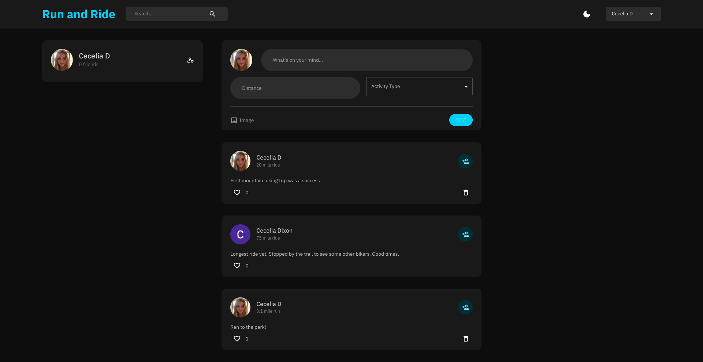
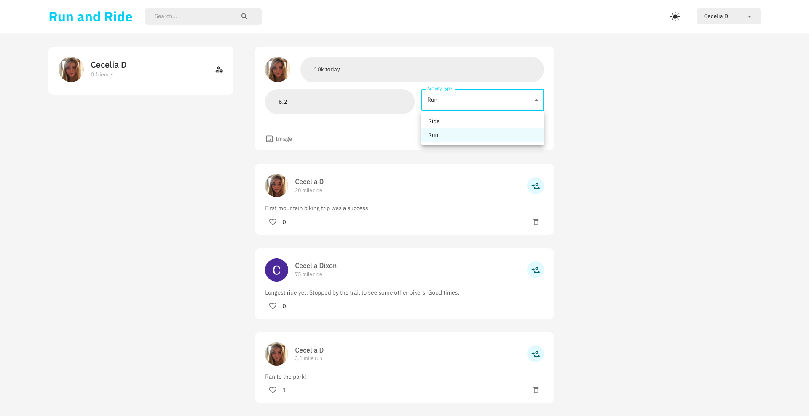
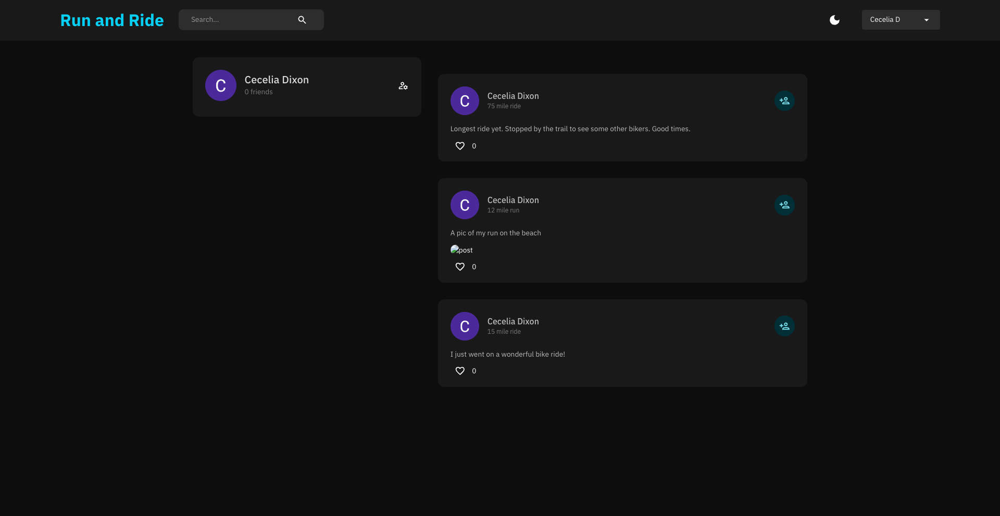

# Run and Ride Web App
The purpose of Run and Ride is to give users the opportunity to make friends and organize sports outings with those around them. When completed a user will have a newsfeed of friend activities and will be able to make posts encouraging other users to RSVP to their runs/rides. Users will also have the capability to like, comment, make groups, and post their own solo/group rides.

# Project Requirements
### User interface with data by at least 2 CRUD operations (create, read, update, delete) for at least one database table
Users can write there own posts that are added to the activities table (create), these posts are then seen in the newsfeed (read), users can like activities and are added to a likes list (update), and delete their own posts. Upon logging in for the first time users' Google ids are added to the users table (create), users are able to be added to each others friend arrays (update). Comments and groups tables exist but due to time were not able to be finished.

### At least 3 different UI routes (appearing to the user as different pages)
Users can access the login page, the home page (activities), and each user has a corresponding page of just their posts.

### At least one Bootstrap UI component not featured in the demo application
I used MUI (Material UI) for all UI. There are several different components in use throughout the website.

### Different layout and design from the demo application; it should not look like an obvious clone
See screenshots

### At least one of the following:
### 3rd party library for React (not including React DnD, unless its use is completely different from the use in the demo project)
### GraphQL interface to the database
### Significant use of Redux for all state handling (instead of useState)
I used Redux for state management and used the library MUI

## Iteration 3 - Frontend
For iteration 3 I made huge progress. Users are able to login through Google and can make their own posts to send to the database. Posts of users can be seen and liked by others. All of the functions have corresponding backend capabilities. When a user is clicked we are brought to their page to see just their posts. I began implementation of a friendship and group capability but ran out of time. The empty third column in the page was meant to have a friends list.

## Screenshots

## Iteration 2 - Frontend
For iteration two I worked a lot on getting Google Authentication to work. The user is now able to login through Google and is met with a personalized home page. There is a button for Dark and Light mode to toggle between looks that is functional. If a user logs in through google for the first time their Google Id and corresponding info is added to the users table of the backend. I added a users widget which uses Redux to determine the current user and then uses the current user to request that user object from the backend and populate the widget. I plan to add more functionality to this such as location, post count, interests and more.

I feel good about the progress that I made and what is left to do on this app. In my final week I am adding a functionality to add friends and a news feed that consists of the posts of friends. This week I had a bit of an issue with Google Authentication, but was able to eventually solve it.

### Screenshots

## Iteration 1 - Frontend
I am working alone on the final project so all progress has been completed by Cecelia Dixon. For iteration 1 of the final project frontend I began with making a React app. I started to configure app/indexes and began styling. For this project I intend to use MUI the React component library and Redux to manage state for this project.

While there is not much to be seen on the frontend as of now I started with my redux state file to handle a dark and light mode, loading posts, friends, and login capabilities. I made routes for each page and this works locally, I tested loading in data, in my most recent push it is rather bare bones. I also made and styled a navbar component to be used.

I still have to implement a profile page, a home page, and a posts page. I need to update services more to load in the data needed from the back end. I also need to learn how to implement making a profile through the google authentication.

### Screenshots

