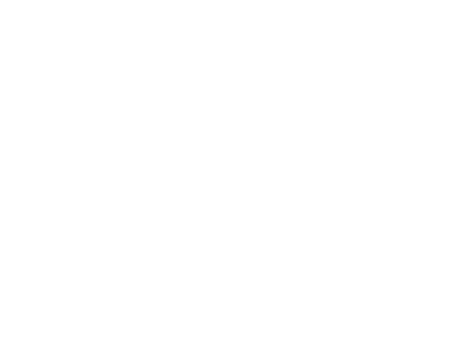

# Run and Ride Web App
The purpose of Run and Ride is to give users the opportunity to make friends and organize sports outings with those around them. When completed a user will have a newsfeed of friend activities and will be able to make posts encouraging other users to RSVP to their runs/rides. Users will also have the capability to like, comment, make groups, and post their own solo/group rides.

## Iteration 1 - Frontend
I am working alone on the final project so all progress has been completed by Cecelia Dixon. For iteration 1 of the final project frontend I began with making a React app. I started to configure app/indexes and began styling. For this project I intend to use MUI the React component library and Redux to manage state for this project.

While there is not much to be seen on the frontend as of now I started with my redux state file to handle a dark and light mode, loading posts, friends, and login capabilities. I made routes for each page and this works locally, I tested loading in data, in my most recent push it is rather bare bones. I also made and styled a navbar component to be used.

I still have to implement a profile page, a home page, and a posts page. I need to update services more to load in the data needed from the back end. I also need to learn how to implement making a profile through the google authentication.

### Screenshots

